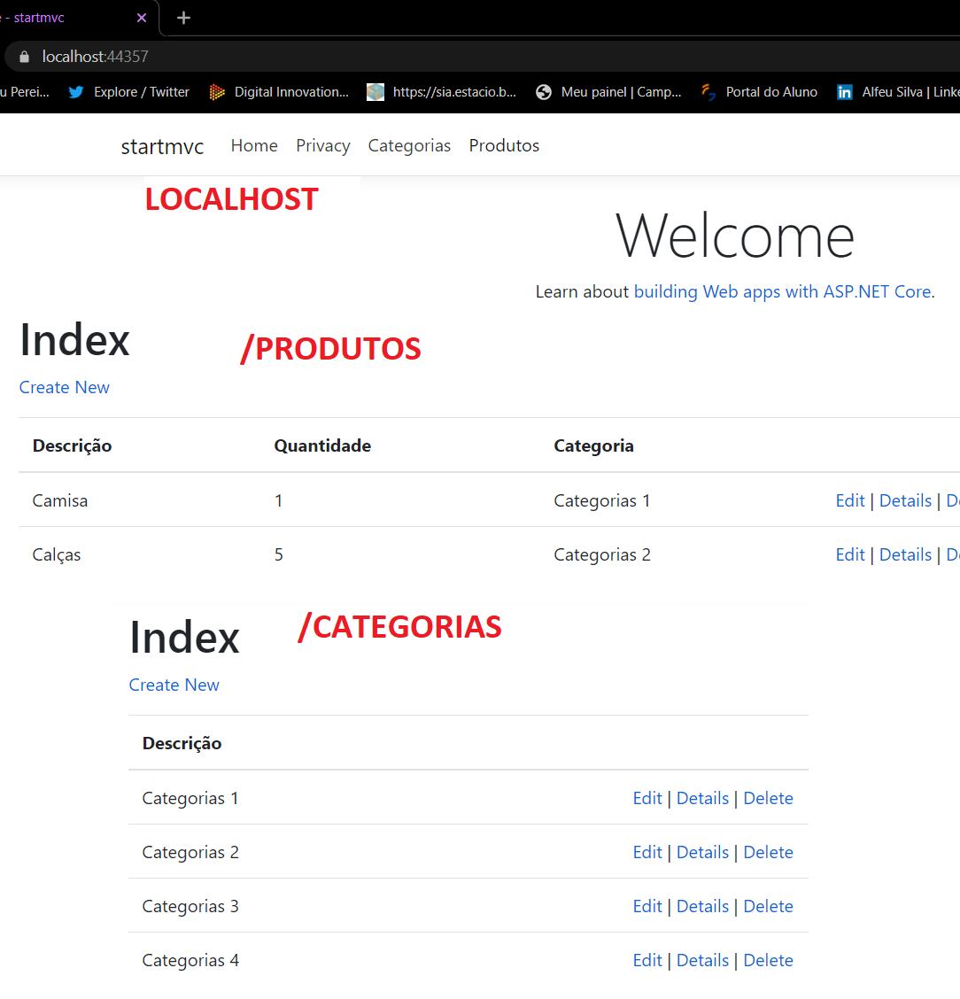
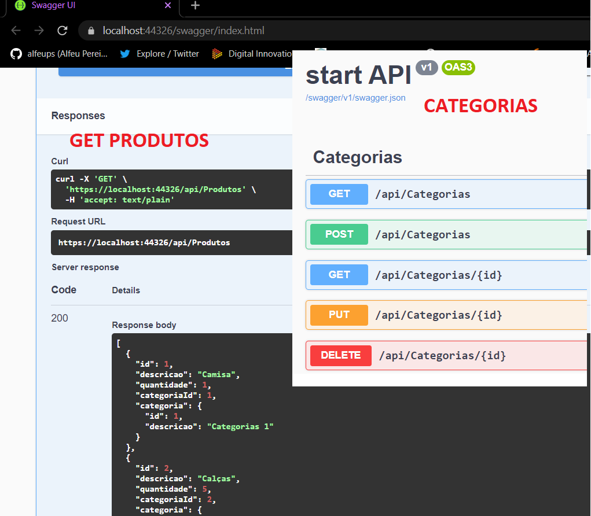
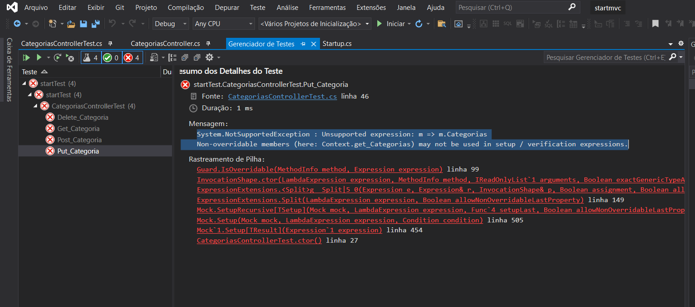

## Developing and Testing an ASP .NET API application

This application was part of the Developing ASP .NET API and .NET MVC Web Applications. This course is part of <a href="https://web.digitalinnovation.one/track/gft-start-2-net">GFT START #2 .NET</a> hosted by <a href="https://web.digitalinnovation.one/home">Digital Innovation One</a>.

First of all, there were some briefs about API, Rest, Restful and Swagger concepts. 

Regarding to ASP .NET aplications before getting started it was explained what Entity Framework stand for, after that what is ASP .NET MVC. Once the theory was review, it was time to go to the heart of the matter: the application. Those were the steps taken to create this app:

This IDE makes developers' life way easier as provide many functions and integrates them perfectly. After having the mvc file created and tested, that was time to use swagger which helps a lot with modelling, documentation and coding. It also has http verbs functions (GET, POST, PUT and DELETE), as you can see in those pictures below:

MVC:

SWAGGER:

The project is now going through the testing process which has presenting some errors so far. When it is fixed, it will be posted and updaloaded in Azure.

